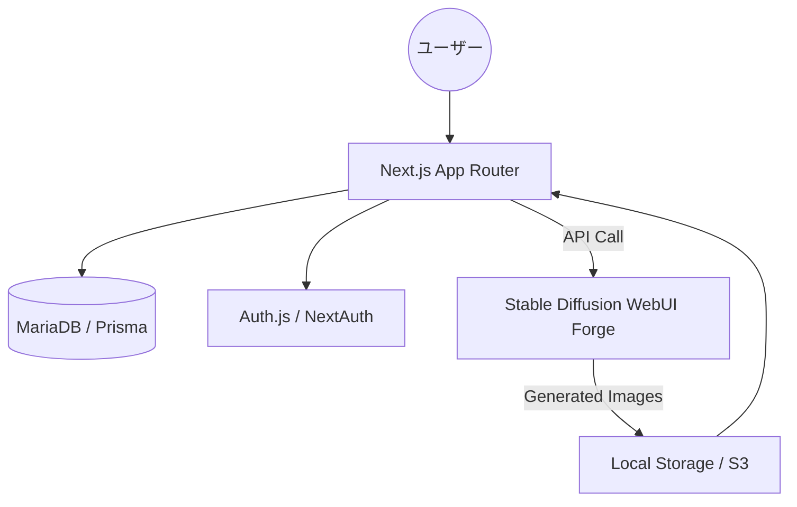

```mermaid
graph TD
    User((ユーザー)) --> NextJS[Next.js App Router]
    NextJS --> MariaDB[(MariaDB / Prisma)]
    NextJS --> Auth[Auth.js / NextAuth]
    NextJS -- API Call --> SD[Stable Diffusion WebUI Forge]
    SD -- Generated Images --> Storage[Local Storage / S3]
    Storage --> NextJS
```