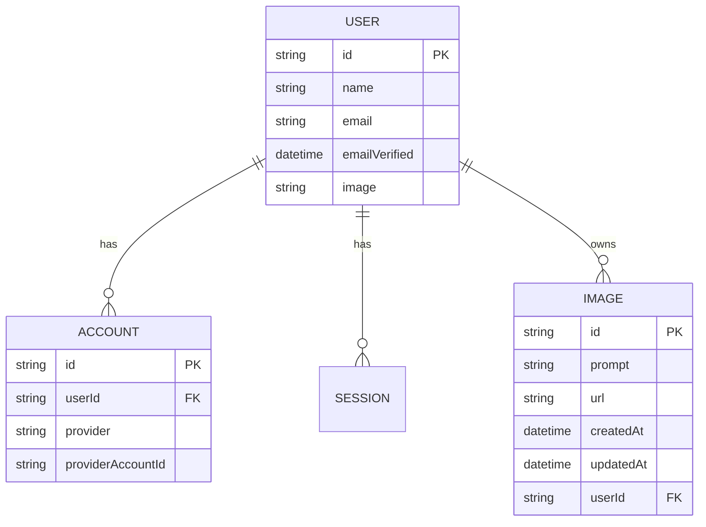

```mermaid
erDiagram
    USER ||--o{ ACCOUNT : "has"
    USER ||--o{ SESSION : "has"
    USER ||--o{ IMAGE : "owns"
    USER {
        string id PK
        string name
        string email
        datetime emailVerified
        string image
    }
    ACCOUNT {
        string id PK
        string userId FK
        string provider
        string providerAccountId
    }
    IMAGE {
        string id PK
        string prompt
        string url
        datetime createdAt
        datetime updatedAt
        string userId FK
    }
```